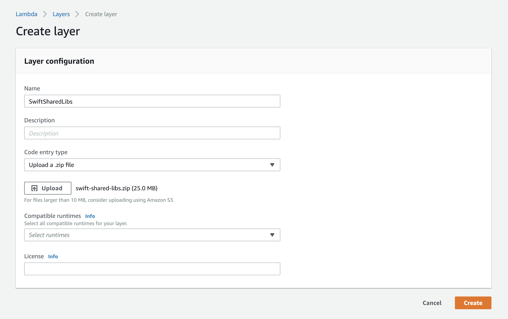
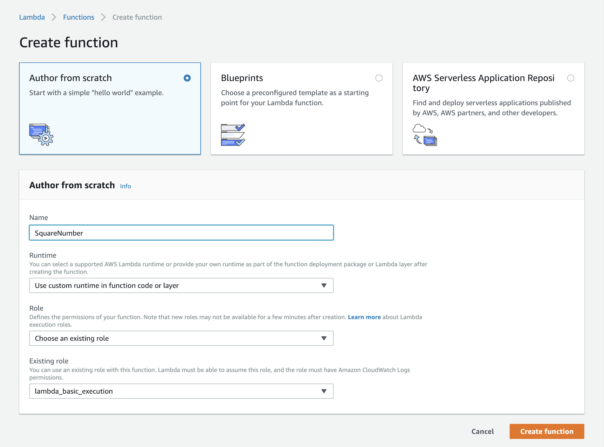
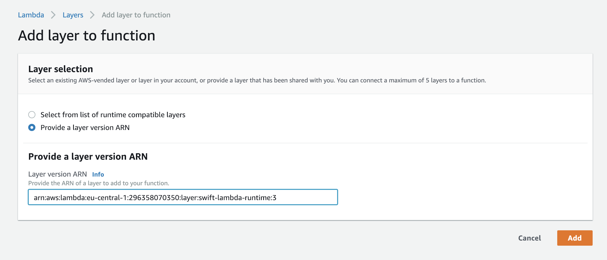
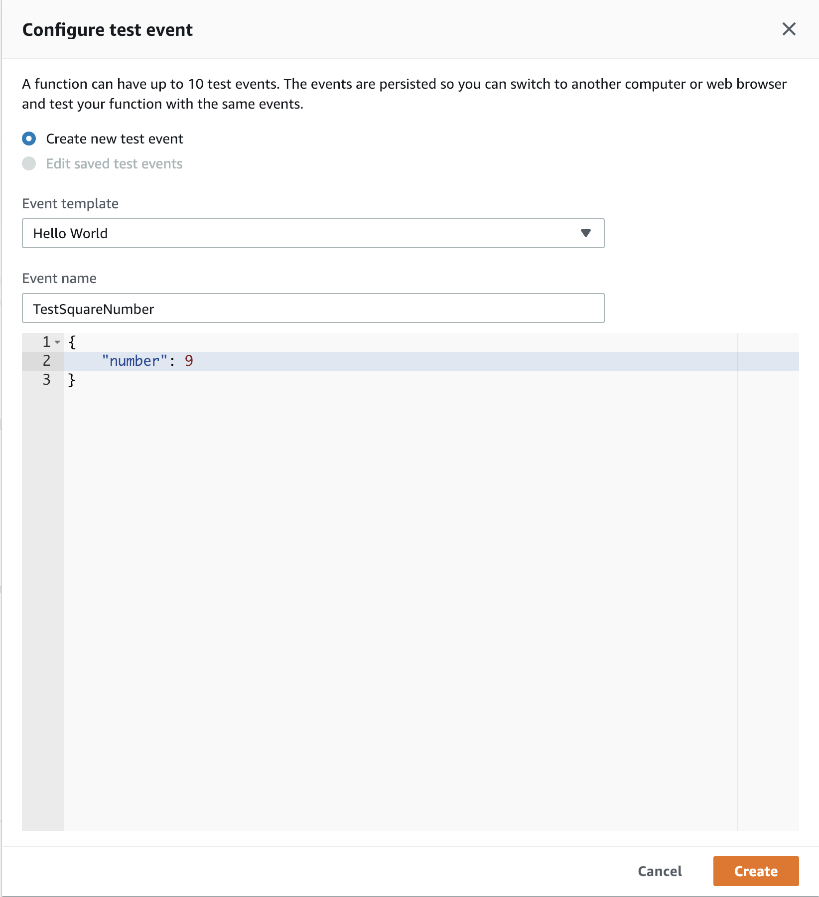
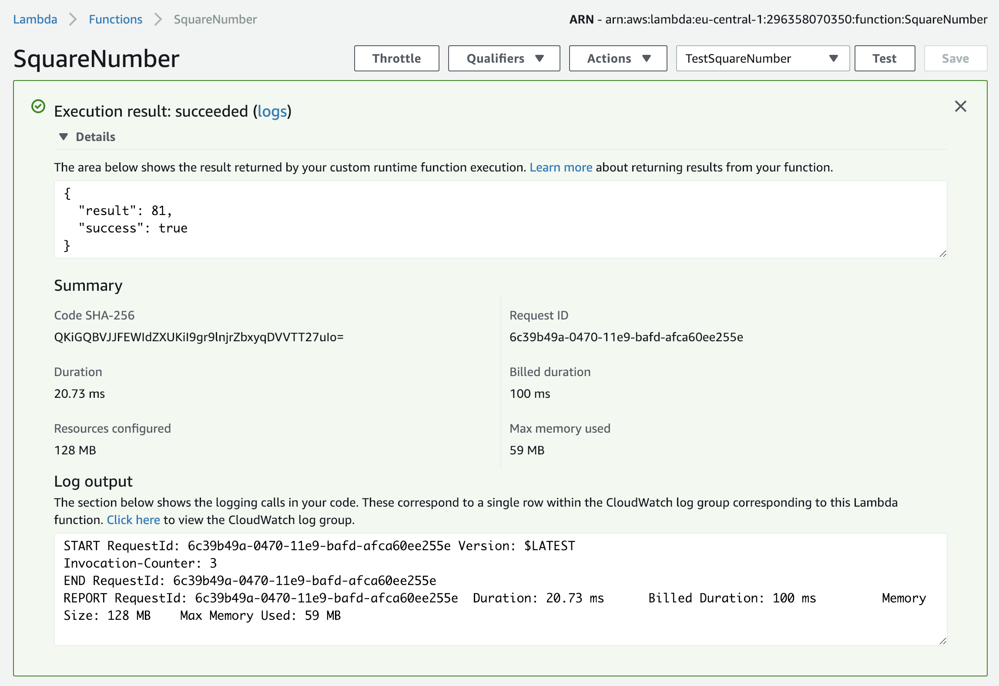

# aws-lambda-swift

[](https://swift.org/download/)

The goal of this project is to implement a custom AWS Lambda Runtime for the Swift programming language.

### Step 1: Implement a lambda handler function
`Examples/SquareNumber` is an SPM package with a single, executable target that implements the lambda handler function.
This package depends on the `AWSLambdaSwift` package which produces a library that contains the actual runtime.
In the main.swift file of the `SquareNumber` executable we import the AWSLambdaSwift library, instantiate the
`Runtime` class and then register our handler function. Finally, we start the runtime:

```swift
import AWSLambdaSwift

struct Input: Codable {
    let number: Double
}

struct Output: Codable {
    let result: Double
}

func squareNumber(input: Input, context: Context) -> Output {
    let squaredNumber = input.number * input.number
    return Output(result: squaredNumber)
}

let runtime = try Runtime()
runtime.registerLambda("squareNumber", handlerFunction: squareNumber)
try runtime.start()
```

The handler function takes two arguments: the `input` object which can be of any type that conforms to the
`Decodable` protocol and the `context` object. It then processes the input and returns an output. The output
can be of any type that conforms to the `Encodable` protocol.

Alternatively, you can also define a handler function which takes and returns a `JSONDictionary`. This type is
just a typealias for the type `Dictionary<String, Any>`:

```swift
import AWSLambdaSwift

extension String: Error {}

func squareNumber(input: JSONDictionary, context: Context) throws -> JSONDictionary {
    guard let number = input["number"] as? Double else {
        throw "invalid input data"
    }

    let squaredNumber = number * number
    return ["result": squaredNumber]
}

let runtime = try Runtime()
runtime.registerLambda("squareNumber", handlerFunction: squareNumber)
try runtime.start()
```

### Step 2: Build the lambda
AWS Lambdas run on Amazon Linux (see [https://docs.aws.amazon.com/lambda/latest/dg/current-supported-versions.html](https://docs.aws.amazon.com/lambda/latest/dg/current-supported-versions.html)).
This means that we can't just run `swift build` on macOS because that will produce a macOS executable which doesn't run on Linux. Instead, I have used Docker to build the `SquareNumber` package.
Execute the following command to build the `SquareNumber` package and bundle the executable in the `lambda.zip` file:

```bash
make package_lambda
```

### Step 3: Build the layer
We now have a Linux executable. However, this executable dynamically links to the Swift standard library and a bunch of other shared libraries (Foundation, Grand Central Dispatch, Glibc, etc). Those
libraries are not available on Amazon Linux. Thus, I created an [AWS Lambda Layer](https://docs.aws.amazon.com/lambda/latest/dg/configuration-layers.html) which contains all of those shared libraries.
The AWS Lambda can then reference this layer. This makes sure that we only have to upload the libraries once instead of every time we want to update the lambda. Run the following command
to create a `swift-lambda-runtime.zip` file that contains the `bootstrap` file and the libraries for the layer:

```bash
make package_layer
```

The `bootstrap` file is a simple shell script that launches the executable.

### Step 4: Setup the layer on AWS
Create a new lambda layer in the AWS Management console using the `swift-lambda-runtime.zip` file:



This might take a few minutes. Once the upload is done, the layer's ARN (Amazon Resource Name) is shown on the page. In the next step we will use this ARN to reference the layer from the lambda.

### Step 5: Setup the lambda on AWS
First create a new lambda function in the AWS Management console and select "Use custom runtime in function code or layer":



Next, select the `lambda.zip` file as the function package to upload and set the handler to "SquareNumber.squareNumber". The first part of the handler should be the same as the name of the executable.
The second part of the handler should be the same as the name that has been used to register the lambda handler in the runtime (see Step 1):


Click on the "Layers" button and then on the "Add a layer" button. Reference the layer we have created in Step 4 using its ARN and click on the "Add" button:



Finally, click the "Save" button in the upper right corner in order to save these changes.

### Step 6: Test the lambda
Now the lambda function is ready for testing. Click on "Select a test event" and then on "Configure test events". Configure a new test event like this:



Then call the lambda function with the new test event by clicking on the "Test" button. You should
see the following result:

 